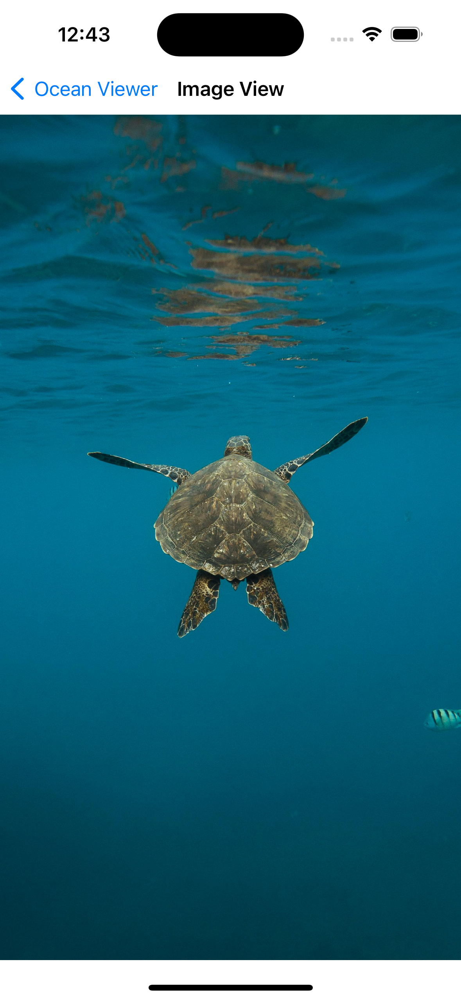

# Ocean Viewer

`Ocean Viewer` is a programmatic UIKit implementation of the [Storm Viewer](#) project from Hacking with Swift. This app `displays a list of images using custom UITableView` and showcases the use of `FileManager` to interact with the app's file system.

## Screens

    
    
    

